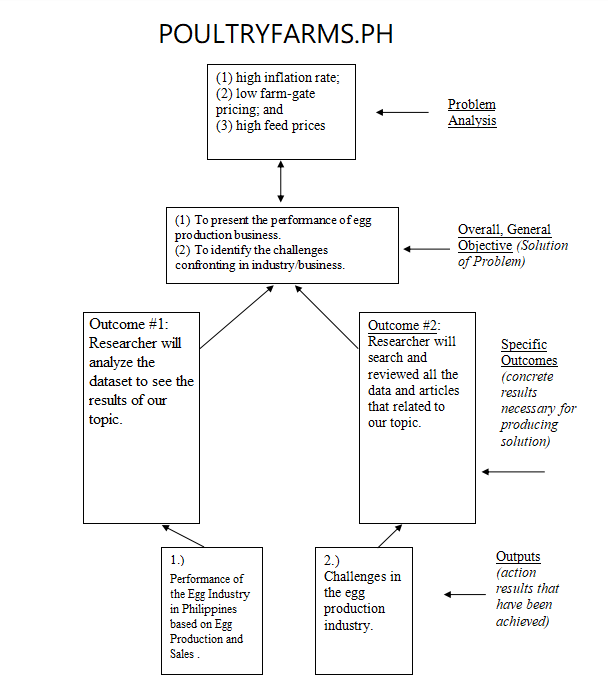

# SANJOSEPOULTRYFARMS.PH
Analysis on Egg Production Business and Sales in San Jose, Batangas, Philippines
## Abstract
This research looked into the business and sales of eggs in San Jose, Batangas, Philippines. This research focused on the egg industry's success over the last three years (2018-2021) in terms of egg production, and annual gross sales. And the challenges it faces. They were the ones who helped to provide the information needed for this study: Municipal agriculturists, resident-owners, backyard poultry farms, and members of the Batangas Egg Producers Cooperative. Poultry in San Jose is profitable and known to have the most production here and will continue to grow over the next five years. Some of the challenges poultry owners face are rising feed prices, changing weather and causing illness in chickens, and the advent of covid -19, which has caused a weakening of businesses in the town of San Jose, Batangas.
## Introduction
Eggs are the most environmentally friendly source of animal protein. The chicken egg has become a basic component of every Filipino family's table as a food item. The egg is one that helps our people to have a livelihood such as poultry, cafeteria/ restaurant, and used ingredients for various products. Batangas is divided into four congressional districts and comprises 32 municipalities and two important cities. San Jose is located in the fourth congressional district, which is designated as the province's agriculture area. The lush soil of San Jose, which was founded on April 26, 1765, was the old San Jose de Malaquing Tubigis, ideal for growing coffee, lanzones, and black pepper. San Jose, as a third-class municipality, has seen significant changes in its agricultural practices over the years.

San Jose is today best recognized for its thriving livestock, poultry, and egg industries. The egg-producing company in this town has grown from a small operation to a large operation. San Jose's proximity to Batangas City, Lipa City, and Metro Manila ensure the municipality's business connections. When compared to pigs and chickens, poultry is the most sustainable major meat. In fact, the municipality is known as the Egg Basket of the Philippines, producing an estimated five million eggs every day (Office of Municipal Agriculturist, San Jose). Today, the Batangas Egg Producers Association (BAEPA) cited that the whole province of Batangas has an estimated 30 million daily egg production with San Jose town as the highest with a declared layers population of 12,543,066 and more than 705 MT chicken egg production on a daily basis. The average farm-gate price of chicken eggs in commercial farms from January to March 2020 was quoted at Php 5.62 per piece, an increase of 20.9 percent compared with the 2019 same period average farm gate price of Php 4.65 per piece. The town has 342 registered independent poultry farms as of June 2020.

Entrepreneurs have the awareness of past, current and future issues affecting their future business enterprise (Laguador, 2013). Based on this socioeconomic context and as a potential resident-entrepreneur, the researcher was motivated to investigate the commercial potentiality of the local egg industry in San Jose, Batangas over a three-year period, from 2018 to 2020, and to identify the challenges or problems that the industry faced during that time.

The findings of this research will be valuable to local egg producers and agricultural land owners not only in San Jose, but also in Batangas Province, in determining whether egg production is a better alternative to crop cultivation (black pepper, coffee and lanzones). This research will also assist farmers' groups such as cooperatives and businesses, feed-milling companies, and local government authorities in channeling financial assistance aimed at improving and expanding agribusiness in the province.

## Statement of the Problem
According to conversations with egg producers in San Jose, the more tough problems they face, the better.
Constantly have to deal with can be ranked in terms of the egg's degree of importance.
(1) high inflation rate; (2) low farm-gate pricing; and (3) high feed prices are all factors that affect the production company.

  

 

As for the average farmgate price of chicken eggs in commercial farms from April to June, PSA observed it to be around P5.50 per piece. This was -1.8 percent lower than the average farmgate price of P5.60 per piece in the same period of 2020.

According to UBRA President Bong Inciong. “The volume of production of eggs is high. Those who lost livelihood in hog and poultry raising all shifted there. Consumers are assured of enough supply of eggs. This can be their only protein source if we run out of pork and chicken". 

The rising coronavirus sickness in 2019 was one of the reasons for the changes in the business (COVID-19). The harshest quarantine settings, according to an industry group, will be particularly devastating to the poultry industry, particularly for small producers.

## Significant of the Project
This study performed a SANJOSEPOULTRYFARMS.PH -Analysis on Egg Production Business and Sales in San Jose, Batangas, Philippines.  The goals of this study are to present the performance of the egg production business in San Jose over the last three years (2018 to 2020) in terms of egg production, and annual gross sales, and to identify the challenges that this industry faces.

This study will be undertaken to provide knowledge and to develop one's ability in business most especially in poultry farming. Benefiting the study are the various sectors as follows:

The Owners, this study will be very beneficial to the owners. Through this research, owners manage effectively their business and help them to increase their income.

The Customers, this research benefits the customers to give them a quality services and good products. Also to provide them the information that they need.

The Government, this study will serve as a basis on pricing and exporting the eggs.

The Future Researchers, the outcome of the study is beneficial to the future researchers. This study may be one of the basis that a new theory in learning will arise. Also, this may serves as one of the sources that they may rely on.

## Methods
The ex-post facto method was used in this action research. The Municipal Agriculturist of San Jose, Batangas, as well as resident-owners and backyard poultry farms, and members of the Batangas Egg Producers Cooperative were among the study's informants (BEPCO). The interview method was used to back up the numerical figures or data collected from the questionnaire.
San Jose, Batangas Municipal Agriculturist and Environment and Natural Resources Office (MAENRO). To offer the Analysis on Egg Production Business and Sales in terms of egg production and gross annual sales in San Jose, Batangas, this study used frequency distribution and regression analysis.

## Expected Output

  

