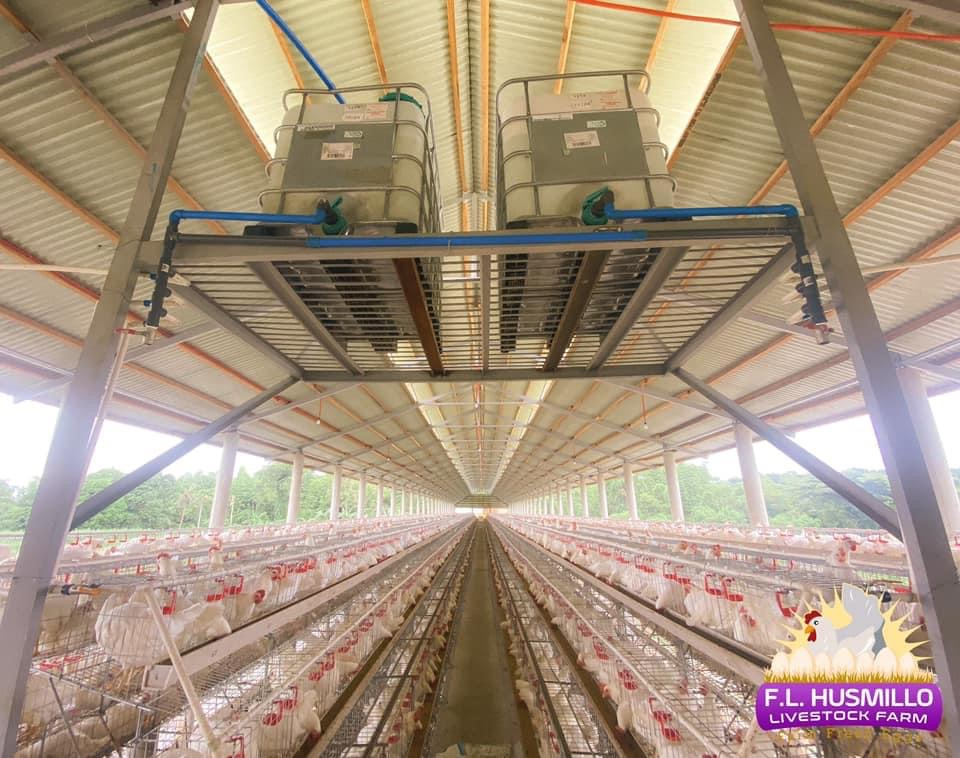
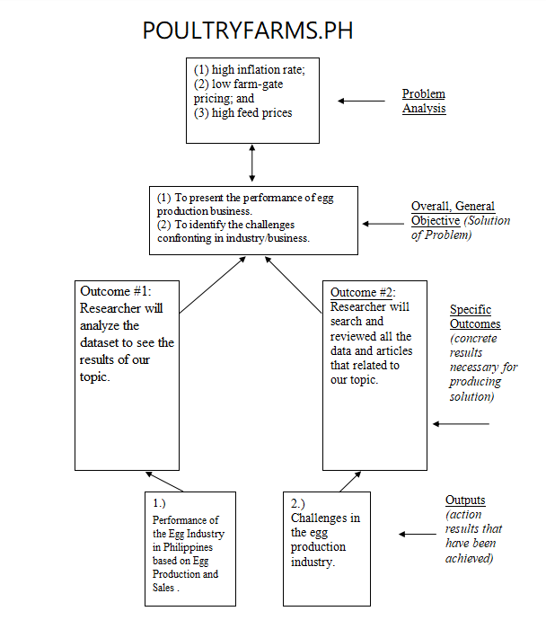

# POULTRYFARMS.PH
Analysis on Egg Production Business and Sales in Philippines
## Abstract
This research looked into the business and sales of eggs in Philippines. This research focused on the egg industry's success over the last three years (2018-2020) in terms of egg production, and annual gross sales. And the challenges it faces. They were the ones who helped to provide the information needed for this study: Philippine Statistical Authority(PSA). Poultry in Philippines is profitable and known to have the most production here and will continue to grow over the next five years. Some of the challenges poultry owners face are rising feed prices, changing weather and causing illness in chickens, and the advent of covid -19, which has caused a weakening of businesses in the regions, or other provinces.
## Introduction
Eggs are the most environmentally friendly source of animal protein. The chicken egg has become a basic component of every Filipino family's table as a food item. The egg is one that helps our people to have a livelihood such as poultry, cafeteria/ restaurant, and used ingredients for various products. Batangas is divided into four congressional districts and comprises 32 municipalities and two important cities. San Jose is located in the fourth congressional district, which is designated as the province's agriculture area. The lush soil of San Jose, which was founded on April 26, 1765, was the old San Jose de Malaquing Tubigis, ideal for growing coffee, lanzones, and black pepper. San Jose, as a third-class municipality, has seen significant changes in its agricultural practices over the years.

According to Agriculture Secretary William Dar, He highlighted the crucial role of the poultry sector in the growth of the agriculture sector during his opening address for the “Philippine Poultry and Livestock Virtual Summit” on August 27, 2021.
Poultry production accounts for 13% of agriculture gross value added (GVA). He said "we aim to help farm families recover from the loss of jobs and unemployment due to the Covid-19 pandemic, and those whose poultry stocks were depleted by avian influenza.”

The findings of this research will be valuable to local egg producers and agricultural landowners, not only in San Jose but also in Batangas Province, in determining whether egg production is a better alternative to crop cultivation (black pepper, coffee, and lanzones). This research will also assist farmers' groups such as cooperatives and businesses, feed-milling companies, and local government authorities in channeling financial assistance aimed at improving and expanding agribusiness in the province.

## Statement of the Problem
According to conversations with egg producers, the more tough problems they face, the better.
Constantly have to deal with can be ranked in terms of the egg's degree of importance.
(1) high inflation rate; (2) low farm-gate pricing; and (3) high feed prices are all factors that affect the production company.

  

 

We all know that we have the egg producers here in the Philippines, but we've known that there's a challenge or problems we encountered in selling eggs.

There's so many platforms we use to sell the eggs like online platforms, and also a fliers. We've encountered so many problems in the chicken like flue or viruses that the chicken facing. So that we have to protect the chicken so that their eggs is good and not rotten.

As for the average farmgate price of chicken eggs by 2018 - 2020, the annual amount in 2018 from January to December is 53,356, in 2019 the annual amount from January to December is 63,532, and lastly the 2020 annual amount is 74,156.This source is from The Agricultural Accounts Division, Philippine Statistics Authority (DDA , PSA)

## Significant of the Project
This study performed a POULTRYFARMS.PH -Analysis on Egg Production Business and Sales in Philippines. This study will be undertaken to provide knowledge and to develop one's ability in business most especially in poultry farming. Benefiting the study are the various sectors as follows:

1. The Owners, this study will be very beneficial to the owners. Through this research, owners manage effectively their business and help them to increase their income.

2. The Customers, this research benefits the customers to give them a quality services and good products. Also to provide them the information that they need.

3. The Government, this study will serve as a basis on pricing and exporting the eggs.

4. The Future Researchers, the outcome of the study is beneficial to the future researchers. This study may be one of the basis that a new theory in learning will arise. Also, this may serves as one of the sources that they may rely on.

## Methods
The ex-post facto method is the one used in conducting this research. The study informants involved in the research were the Municipal Agriculturist of San Jose, Batangas, resident-owners and backyard poultry farms, and members of the Batangas Egg Producers Cooperative (BEPCO). The interview method was used to back up the numerical figures or data collected from the questionnaire.
In San Jose, Batangas, Municipal Agriculturist and Environment and Natural Resources Office (MAENRO). To offer the Analysis of Egg Production Business and Sales in terms of egg production and gross annual sales in San Jose, Batangas, this study used frequency distribution and regression analysis.

## Expected Output

  

